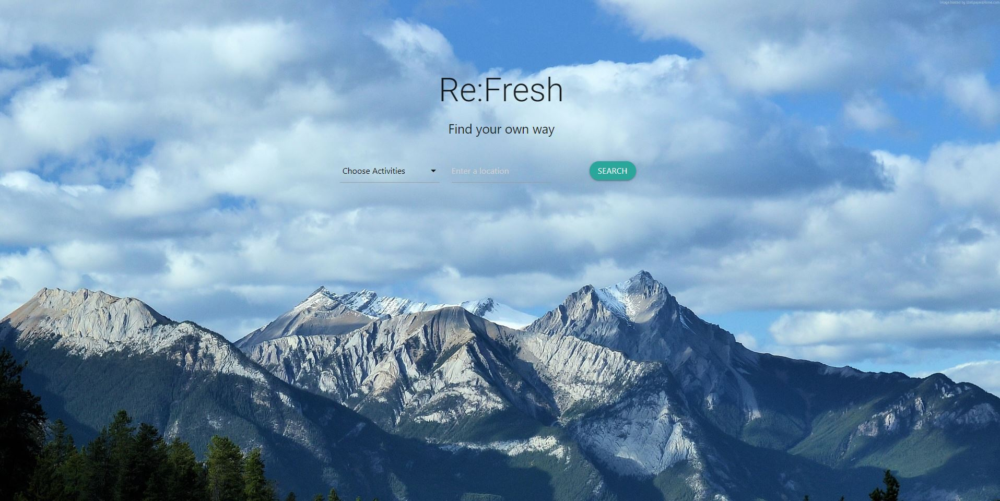
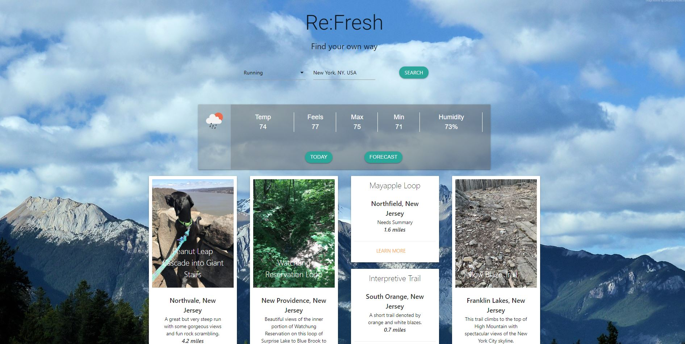
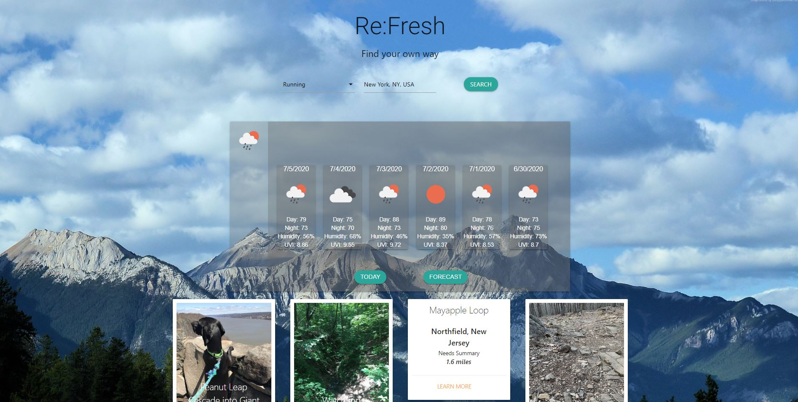

# Project Refresh

---

Murad Alkaylanie, Macenna Cowen, Sulayman Sallah

Description:

This project allows users to search for outdoor activities that they can do within a certain distance of their location.

---
Application link: https://kaylan83.github.io/projectOne/

---

## UI Mockup

---

## APIs Used

- Running Trails: https://www.trailrunproject.com/data
- Biking Trails: https://rapidapi.com/trailapi/api/trailapi
- Rock climbing: https://www.mountainproject.com/data
- Google Places: https://developers.google.com/places/web-service/intro
- Open Weather: https://openweathermap.org/api

---

### Team Member Roles

Murad:
- JavaScript
- CSS
- HTML
- Jquery
- Materialize
- Ajax

---

Macenna: 
- JavaScript
- CSS
- HTML
- Jquery
- Materialize
- Ajax

---

Saul:
- JavaScript
- CSS
- HTML
- Jquery
- Materialize
- Ajax

