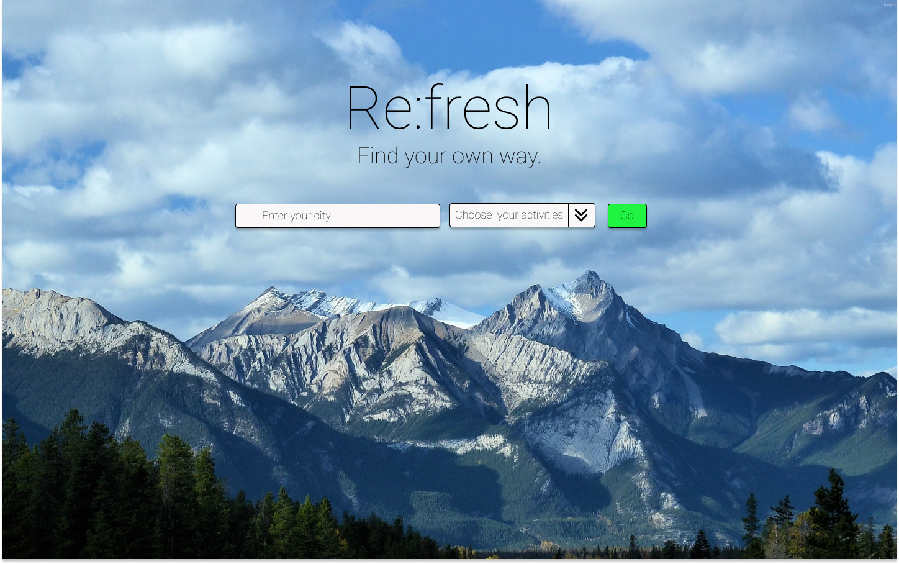

#Refresh
##Group Project 1

---

**#Project Refresh**
**##Murad Alkaylanie, Macenna Cowen, Sulayman Sallah##**

**##Description**

This project allows users to search for outdoor activities that they can do within a certain distance of their location.

---

**##UI Mockup**

---

##APIs Used

- FourSquare: https://developer.foursquare.com/docs/places-api/
- Running Trails: https://www.trailrunproject.com/data
- Hiking Trails: https://www.hikingproject.com/data
- Rock climbing: https://www.mountainproject.com/data
- Outdoor Activity API: https://rapidapi.com/trailapi/api/trailapi
- Places Api: https://developer.foursquare.com/
- Weather API: https://developer.yahoo.com/weather/documentation.html

---

###Team Member Roles

Murad:
- JavaScript
- CSS
- HTML
- Jquery
- Materialize
- Ajax

---

Macenna: 
- JavaScript
- CSS
- HTML
- Jquery
- Materialize
- Ajax

---

Saul:
- JavaScript
- CSS
- HTML
- Jquery
- Materialize
- Ajax

